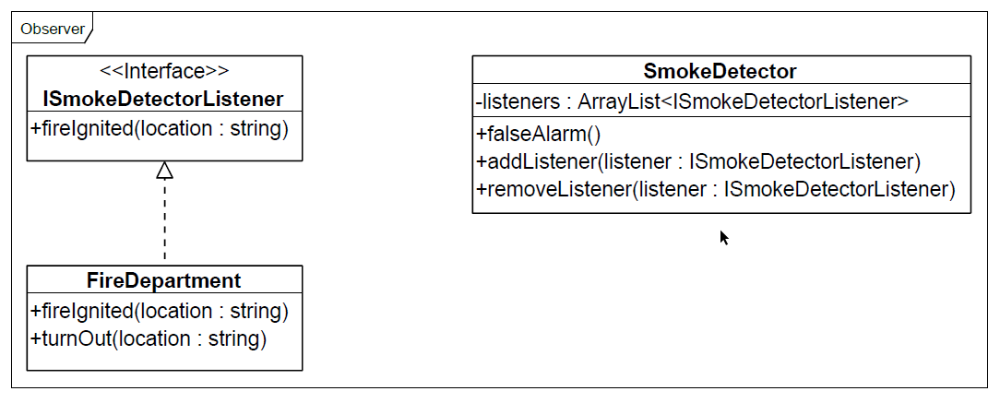
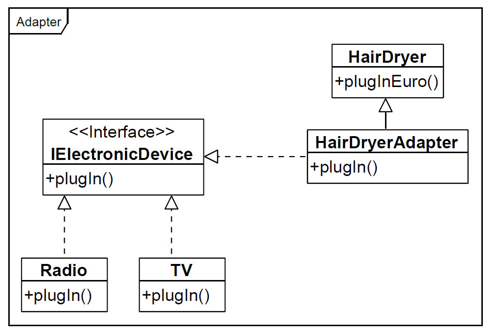

 # USBAdapter

 ## Task
 > Ein Computer hat eine USB2-Schnittstelle. Ein DVD-Brenner hat eine USB3-Schnittstelle. Der DVD-Brenner wird über einen Adapter an den Computer angeschlossen. Ein Systemprozess im Computer beobachtet kontinuierlich die USB2-Schnittstelle und generiert eine Meldung, sobaldein Gerät (in diesem Fall der Adapter) an die USB2-Schnittstelle angeschlossen wurde.

 ## Used Design Pattern
 ### Observer
 In this example the observer gets registered to an object which notifys the observer, when the watched event is fired
 
 
 ### Adapter
 In this example an interface gets created which multiple objects implements to get used universally.
 
